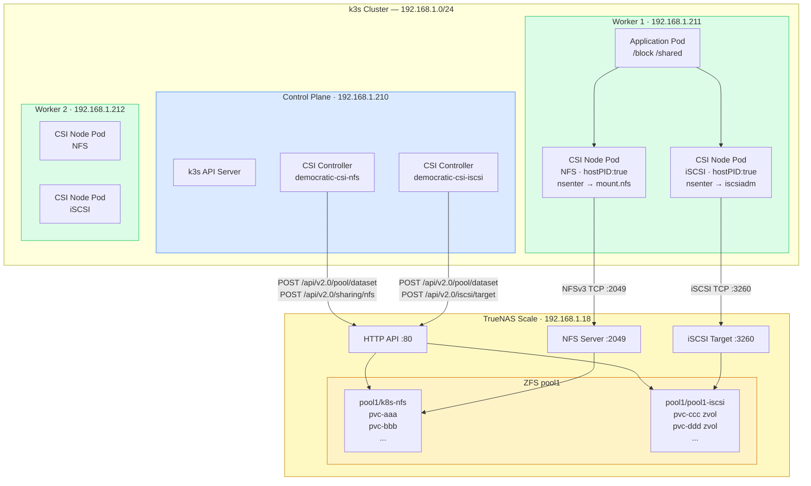
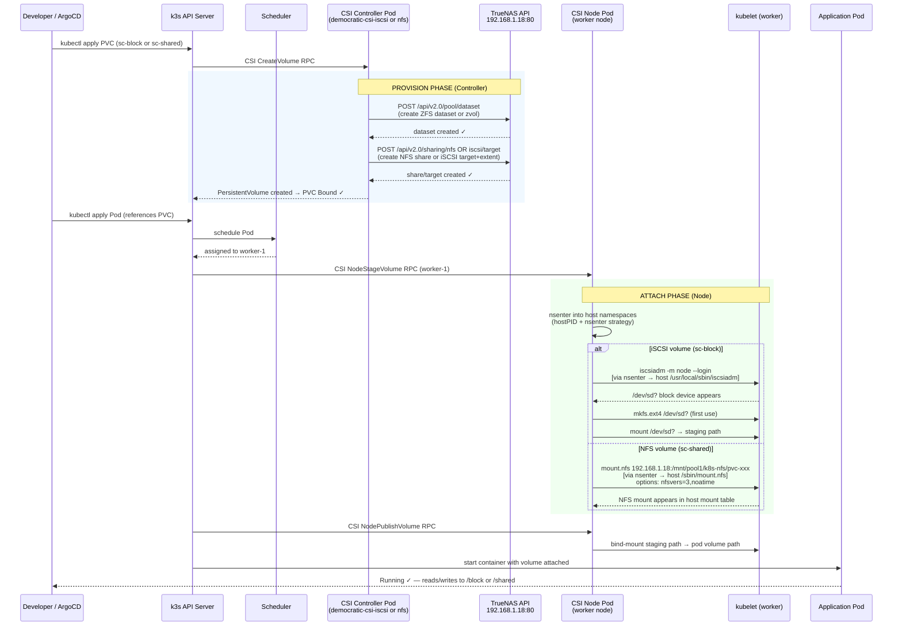

# Democratic-CSI — Local Cluster Architecture

> How persistent storage flows from a Kubernetes pod request all the way to TrueNAS Scale and back.

---

## 1. Big Picture — What Is Democratic-CSI?

```
┌─────────────────────────────────────────────────────────────────────┐
│                        YOUR LOCAL CLUSTER                           │
│                                                                     │
│  Pod requests storage  ──►  democratic-csi  ──►  TrueNAS Scale     │
│                                                   192.168.1.18      │
│  RWO (databases)       ──►  iSCSI driver    ──►  pool1/pool1-iscsi  │
│  RWX (shared files)    ──►  NFS driver      ──►  pool1/k8s-nfs      │
└─────────────────────────────────────────────────────────────────────┘
```

Democratic-CSI is a **Container Storage Interface** driver. It translates Kubernetes storage requests (PersistentVolumeClaim) into real storage objects on TrueNAS — no manual NFS share creation, no manual iSCSI target setup. Everything is automated on demand.

---

## 2. Cluster Node Layout



```
┌──────────────────────────────────────────────────────────────────────────────┐
│                           k3s LOCAL CLUSTER                                  │
│                                                                              │
│  ┌─────────────────────┐   ┌─────────────────────┐   ┌───────────────────┐  │
│  │   control-plane      │   │     worker-1         │   │    worker-2       │  │
│  │   192.168.1.210      │   │   192.168.1.211      │   │  192.168.1.212    │  │
│  │                      │   │                      │   │                   │  │
│  │  k3s API server      │   │  nfs-common ✓        │   │  nfs-common ✓     │  │
│  │  etcd                │   │  open-iscsi ✓        │   │  open-iscsi ✓     │  │
│  │  scheduler           │   │  iscsiadm ✓          │   │  iscsiadm ✓       │  │
│  │  controller-mgr      │   │                      │   │                   │  │
│  │                      │   │  CSI Node Pod        │   │  CSI Node Pod     │  │
│  │  CSI Controller Pod  │   │  (NFS + iSCSI)       │   │  (NFS + iSCSI)    │  │
│  └─────────────────────┘   └─────────────────────┘   └───────────────────┘  │
│              │                        │                        │             │
│              └────────────────────────┴────────────────────────┘            │
│                                       │                                      │
│                             192.168.1.0/24 LAN                              │
└───────────────────────────────────────┼──────────────────────────────────────┘
                                        │
                            ┌───────────▼───────────┐
                            │    TrueNAS Scale        │
                            │    192.168.1.18         │
                            │                         │
                            │  HTTP API  :80          │
                            │  iSCSI     :3260        │
                            │  NFS       :2049        │
                            │                         │
                            │  pool1/k8s-nfs     (NFS)│
                            │  pool1/pool1-iscsi (iSC)│
                            └─────────────────────────┘
```

---

## 3. Two Drivers — One Helm Chart Deployed Twice

```
┌─────────────────────────────────────────────────────────────┐
│                democratic-csi namespace                      │
│                                                             │
│  ┌──────────────────────────────┐                          │
│  │  Release: democratic-csi-nfs │   StorageClass: sc-shared │
│  │  Driver:  org.democratic-    │   ──── RWX (ReadWriteMany)│
│  │           csi.nfs            │   ──── NFS mount          │
│  │  Config:  secret-nfs         │   ──── pool1/k8s-nfs      │
│  └──────────────────────────────┘                          │
│                                                             │
│  ┌────────────────────────────────┐                        │
│  │  Release: democratic-csi-iscsi │  StorageClass: sc-block │
│  │  Driver:  org.democratic-      │  ──── RWO (ReadWriteOnce│
│  │           csi.iscsi            │  ──── Block device/ext4  │
│  │  Config:  secret-iscsi         │  ──── pool1/pool1-iscsi  │
│  └────────────────────────────────┘                        │
└─────────────────────────────────────────────────────────────┘
```

Each release has:
- A **Controller** Deployment (1 replica — runs on any node, talks to TrueNAS API)
- A **Node** DaemonSet (runs on every node — handles mount/unmount)

---

## 4. Pod Lifecycle — From PVC to Running Pod



---

## 5. NFS Driver Internals — Namespace Problem & nsenter Solution

```
THE PROBLEM:
─────────────────────────────────────────────────────────────

  ┌─────────────────────────────────────────────┐
  │  CSI Node Container                         │
  │  (isolated Linux namespaces)                │
  │                                             │
  │  $ mount -t nfs 192.168.1.18:/share /mnt    │
  │           ↓                                 │
  │   runs in CONTAINER mount namespace         │
  │   → host kubelet sees nothing               │
  │   → pod can never attach the volume    ✗    │
  └─────────────────────────────────────────────┘


THE FIX — nsenter strategy:
─────────────────────────────────────────────────────────────

  ┌─────────────────────────────────────────────┐
  │  CSI Node Container  (hostPID: true)         │
  │                                             │
  │  $ nsenter \                                │
  │      --mount=/proc/1/ns/mnt \               │
  │      --net=/proc/1/ns/net \                 │◄── PID 1 is visible
  │      -- /sbin/mount.nfs \                   │    because hostPID:true
  │         192.168.1.18:/share /mnt            │
  │           ↓                                 │
  │   runs in HOST mount namespace    ✓         │
  │   → kubelet sees the mount                  │
  │   → pod gets the volume           ✓         │
  └─────────────────────────────────────────────┘


values-nfs.yaml settings that enable this:
─────────────────────────────────────────────────────────────

  node:
    hostPID: true                        ← see host PID 1 to enter its namespaces
    driver:
      extraEnv:
        - name: NFS_MOUNT_STRATEGY
          value: nsenter                 ← use nsenter instead of direct mount call
        - name: NFS_MOUNT_PATH
          value: /sbin/mount.nfs         ← path of mount.nfs ON THE HOST (not in container)
```

---

## 6. iSCSI Driver Internals — nsenter + Session Management

```
values-iscsi.yaml settings:
─────────────────────────────────────────────────────────────

  node:
    hostPID: true
    driver:
      extraEnv:
        - name: ISCSIADM_HOST_STRATEGY
          value: nsenter               ← run iscsiadm in host namespaces
        - name: ISCSIADM_HOST_PATH
          value: /usr/local/sbin/iscsiadm  ← symlink on Debian 13 worker nodes
      iscsiDirHostPath: /etc/iscsi     ← bind-mount host's iSCSI config dir into pod
      iscsiDirHostPathType: ""         ← don't fail if path doesn't exist yet


iSCSI session flow on a worker node:
─────────────────────────────────────────────────────────────

  CSI Node Pod
       │
       ├─ nsenter → host net+mnt namespace
       │       ├─ iscsiadm -m discovery -t st -p 192.168.1.18:3260
       │       ├─ iscsiadm -m node -T iqn.2005-10.org.freenas.ctl:csi-pvc-xxx-k3s --login
       │       └─ /dev/sdb  appears on host
       │
       ├─ detect /dev/sdb (block device from TrueNAS zvol)
       ├─ mkfs.ext4 /dev/sdb  (first time only)
       ├─ mount /dev/sdb → /var/lib/kubelet/plugins/.../staging/pvc-xxx
       └─ bind-mount → /var/lib/kubelet/pods/<uid>/volumes/pvc-xxx
                              ↓
                      Pod sees /block/
```

---

## 7. Kustomize Deployment Structure

```
scripts/democratic-csi/
│
├── base/
│   ├── kustomization.yaml        ← declares namespace + storageclass resources
│   ├── namespace.yaml            ← democratic-csi namespace
│   └── storageclass.yaml         ← sc-block (iSCSI, default) + sc-shared (NFS)
│
└── overlays/
    └── local-truenas/
        ├── kustomization.yaml    ← wires base + helmCharts + secrets
        │
        │   helmCharts:
        │     - democratic-csi v0.14.6 → releaseName: democratic-csi-iscsi
        │     - democratic-csi v0.14.6 → releaseName: democratic-csi-nfs
        │
        ├── secret-iscsi.yaml     ← TrueNAS connection + ZFS/iSCSI config
        ├── secret-nfs.yaml       ← TrueNAS connection + ZFS/NFS config
        ├── values-iscsi.yaml     ← Helm values: driver name, nsenter env, resources
        └── values-nfs.yaml       ← Helm values: driver name, nsenter env, resources


Deploy command:
─────────────────────────────────────────────────────────────

  kubectl kustomize scripts/democratic-csi/overlays/local-truenas --enable-helm \
    | kubectl apply -f -

  # --enable-helm required because kustomization.yaml uses helmCharts:
```

---

## 8. Storage Classes & Use Cases

```
┌────────────────────────────────────────────────────────────────────────────────┐
│  StorageClass: sc-block  (DEFAULT)                                             │
│  Provisioner: org.democratic-csi.iscsi                                         │
│  Access Mode: RWO  (ReadWriteOnce — one node at a time)                        │
│  Volume Type: iSCSI block device formatted as ext4                             │
│  Reclaim:     Retain                                                           │
│  Binding:     WaitForFirstConsumer (waits for pod scheduling)                  │
│                                                                                │
│  Best for:  PostgreSQL, MySQL, Redis, MongoDB, Elasticsearch                   │
│             → Low-latency, POSIX-compliant, exclusive write access             │
│             → Each PVC = 1 ZFS zvol on pool1/pool1-iscsi                       │
│             → Named: csi-pvc-<uuid>-k3s                                        │
└────────────────────────────────────────────────────────────────────────────────┘

┌────────────────────────────────────────────────────────────────────────────────┐
│  StorageClass: sc-shared                                                       │
│  Provisioner: org.democratic-csi.nfs                                           │
│  Access Mode: RWX  (ReadWriteMany — many pods/nodes simultaneously)            │
│  Volume Type: NFS mount (NFSv3, noatime)                                       │
│  Reclaim:     Retain                                                           │
│  Binding:     WaitForFirstConsumer                                             │
│                                                                                │
│  Best for:   Upload directories, media files, shared config, ML datasets       │
│              → Multiple pods on different nodes read/write the same volume     │
│              → Each PVC = 1 ZFS dataset on pool1/k8s-nfs                       │
│              → NFS share exported to 192.168.1.0/24 only                       │
└────────────────────────────────────────────────────────────────────────────────┘
```

---

## 9. TrueNAS Objects Created Per PVC

```
WHEN YOU CREATE A PVC WITH sc-block (iSCSI):
───────────────────────────────────────────────────────────────────────

  Kubernetes:   PersistentVolume pvc-<uuid>
                PersistentVolumeClaim test-block

  TrueNAS:      ZFS zvol:       pool1/pool1-iscsi/pvc-<uuid>
                iSCSI extent:   csi-pvc-<uuid>-k3s
                iSCSI target:   csi-pvc-<uuid>-k3s
                iSCSI target←→extent association (LUN 0)
                Connected to:   Portal Group 1 (0.0.0.0:3260)
                                Initiator Group 1 (allow all)


WHEN YOU CREATE A PVC WITH sc-shared (NFS):
───────────────────────────────────────────────────────────────────────

  Kubernetes:   PersistentVolume pvc-<uuid>
                PersistentVolumeClaim test-shared

  TrueNAS:      ZFS dataset:    pool1/k8s-nfs/pvc-<uuid>
                Quota:          set (=requested PVC size)
                Permissions:    0777
                NFS share:      /mnt/pool1/k8s-nfs/pvc-<uuid>
                Allowed nets:   192.168.1.0/24
                Root mapping:   root:root
```

---

## 10. Data Path — End to End

```
  Application Pod
       │
       │  write("/shared/upload.jpg")
       ▼
  /var/lib/kubelet/pods/<uid>/volumes/kubernetes.io~csi/pvc-xxx/mount
       │  (bind-mount by CSI NodePublishVolume)
       ▼
  /var/lib/kubelet/plugins/kubernetes.io/csi/org.democratic-csi.nfs/staging/pvc-xxx
       │  (NFS mount by CSI NodeStageVolume)
       ▼
  Linux kernel NFS client  (running in HOST mount namespace via nsenter)
       │  NFSv3 over TCP
       ▼
  TrueNAS NFS server  192.168.1.18:2049
       │
       ▼
  ZFS dataset: pool1/k8s-nfs/pvc-xxx
       │  (with quota enforcement, 0777 perms)
       ▼
  Physical disk(s) in Proxmox VM → TrueNAS ZFS pool1


  ──── iSCSI path (sc-block) ────────────────────────────────────────

  Application Pod
       │  write("/block/data.db")
       ▼
  /dev/sdb  →  ext4 filesystem  →  iSCSI block device
       │  iSCSI over TCP
       ▼
  TrueNAS iSCSI target  192.168.1.18:3260
       │
       ▼
  ZFS zvol: pool1/pool1-iscsi/pvc-xxx  (extentBlocksize=512, SSD tuned)
```

---

## 11. Pods Running in the Cluster

```
Namespace: democratic-csi
──────────────────────────────────────────────────────────────

┌─────────────────────────────────────────────────────────────┐
│  CONTROLLER (Deployment — 1 replica, anywhere)              │
│                                                             │
│  democratic-csi-iscsi-controller-xxx                        │
│  ├── democratic-csi   ← talks to TrueNAS HTTP API :80       │
│  ├── csi-provisioner  ← watches PVC creation events         │
│  ├── csi-attacher     ← handles volume attach/detach        │
│  └── csi-resizer      ← handles PVC resize requests         │
│                                                             │
│  democratic-csi-nfs-controller-xxx                          │
│  ├── democratic-csi   ← talks to TrueNAS HTTP API :80       │
│  ├── csi-provisioner                                        │
│  ├── csi-attacher                                           │
│  └── csi-resizer                                            │
└─────────────────────────────────────────────────────────────┘

┌─────────────────────────────────────────────────────────────┐
│  NODE (DaemonSet — 1 per worker node)                       │
│                                                             │
│  democratic-csi-iscsi-node-xxx  (on each of .211, .212)     │
│  ├── democratic-csi   ← handles stage/publish/unmount       │
│  │   hostPID: true    ← sees host process tree              │
│  │   nsenter          ← enters host namespaces for iscsiadm │
│  │   /etc/iscsi mount ← reads/writes host iSCSI sessions    │
│  └── csi-node-driver-registrar ← registers with kubelet     │
│                                                             │
│  democratic-csi-nfs-node-xxx  (on each of .211, .212)       │
│  ├── democratic-csi   ← handles stage/publish/unmount       │
│  │   hostPID: true    ← sees host process tree              │
│  │   nsenter          ← enters host namespaces for mount.nfs │
│  └── csi-node-driver-registrar                              │
└─────────────────────────────────────────────────────────────┘
```

---

## 12. Config File Map

| File | What It Does |
|---|---|
| [overlays/local-truenas/kustomization.yaml](democratic-csi/overlays/local-truenas/kustomization.yaml) | Wires base resources + two Helm chart instances + secrets |
| [overlays/local-truenas/secret-nfs.yaml](democratic-csi/overlays/local-truenas/secret-nfs.yaml) | TrueNAS API credentials + ZFS parent dataset + NFS share settings |
| [overlays/local-truenas/secret-iscsi.yaml](democratic-csi/overlays/local-truenas/secret-iscsi.yaml) | TrueNAS API credentials + ZFS parent dataset + iSCSI target settings |
| [overlays/local-truenas/values-nfs.yaml](democratic-csi/overlays/local-truenas/values-nfs.yaml) | Helm values: driver name, nsenter env vars, resource limits |
| [overlays/local-truenas/values-iscsi.yaml](democratic-csi/overlays/local-truenas/values-iscsi.yaml) | Helm values: driver name, nsenter env vars, iscsiDirHostPath |
| [base/storageclass.yaml](democratic-csi/base/storageclass.yaml) | Defines `sc-block` (iSCSI, default) and `sc-shared` (NFS, RWX) |
| [base/namespace.yaml](democratic-csi/base/namespace.yaml) | Creates `democratic-csi` namespace with `privileged` pod security |

---

## 13. Troubleshooting Reference

```
# Check controller pod logs (provisioning failures)
kubectl logs -n democratic-csi deploy/democratic-csi-iscsi-controller -c democratic-csi
kubectl logs -n democratic-csi deploy/democratic-csi-nfs-controller -c democratic-csi

# Check node pod logs (mount failures)
kubectl logs -n democratic-csi ds/democratic-csi-iscsi-node -c democratic-csi
kubectl logs -n democratic-csi ds/democratic-csi-nfs-node -c democratic-csi

# List all PVCs and their bound PVs
kubectl get pvc -A
kubectl get pv

# Describe a stuck PVC
kubectl describe pvc <name> -n <namespace>

# Describe a stuck pod
kubectl describe pod <name> -n <namespace>

# Check TrueNAS API directly
curl -s -H "Authorization: Bearer <apiKey>" http://192.168.1.18/api/v2.0/pool/dataset \
  | jq '.[].name' | grep k8s

# Re-deploy after config changes
kubectl kustomize scripts/democratic-csi/overlays/local-truenas --enable-helm \
  | kubectl apply -f -

# Restart node daemonsets to pick up new Secret values
kubectl rollout restart ds/democratic-csi-nfs-node -n democratic-csi
kubectl rollout restart ds/democratic-csi-iscsi-node -n democratic-csi
```
